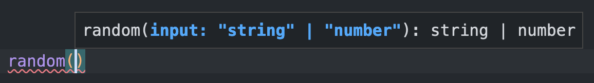

# 
   [](https://codecov.io/gh/adrgautier/fffunction) [](https://www.npmjs.com/package/fffunction)

**fffunction** is a tool which simplifies **polymorphic** functions declaration and adds **type constraints** to the implemention function.

> This module is experimental: use it at your own risk. 

# Motivation

Out of the box, it is not possible in TypeScript to declare polymorphic functions **with proper type checking** of the implementation.

This project tries to adresses this problem, by providing **a simple API** to declare type checked polymorphic functions.

# Quick example

Here is an example of a function which return either a random `number` or a random `string` according to its input value:

```ts
const random = fffunction
    .f<(type: "number") => number>()
    .f<(type: "string") => string>()
    .f(function ([check, type]) {
      if (type === "number") {
        return check(Math.random());
      }
      return check(uuidv4());
    });
```

If the value `"number"` is provided, a random number will be returned.

```ts
console.log(random("number")); // 0.024689827372012196
```

If the value `"string"` is provided, an uuid will be returned.
```ts
console.log(random("string")); // 425dd1a0-cfc0-4eac-a2d7-486860d9bdd4
```

The returned type **is guaranted** by the `check` function.

# How to use 

## Signatures declaration

### `.f<TSignature>()`

Declaring a function signature is done by calling the `.f()` method with no argument by passing the function signature as follow:

```ts
fffunction
   .f<(type: "string") => string>()
```

Signature declarations are queued like this:

```ts
fffunction
   .f<(type: "string") => string>()
   .f<(type: "number") => number>()
```

A signature can expect multiple arguments:

```ts
fffunction
   .f<(type: "string", mode: "v4") => string>()
   .f<(type: "number") => number>()
```

### Constraints

Input types can overlap each others, however the **most specific** input types must be **declared first**:

```ts
fffunction
   .f<(i: { id: number, name: string }) => Profile>()
   .f<(i: { id: number }) => Item>()
```

*fffunction* prevents declaring signatures in the **wrong order**:

```ts
fffunction
   .f<(i: { id: number }) => Item>() 
   .f<(i: { id: number, name: string }) => Profile>()
      ^^^^^^^^^^^^^^^^^^^^^^^^^^^^^^^^^^^^^^^^^^^^ 
// Type 'Profile' is not assignable to type 'never'. ts(2344)
```

*Primitive* types **cannot overlap** each others:

```ts
fffunction
   .f<(a: `https://${string}`) => URL>() 
   .f<(a: string) => string>() 
      ^^^^^^^^^^^^^^^^^^^^^   
// Type 'string' is not assignable to type 'never'. ts(2344)
```

This ensures that each input type can be **narrowed down** later in the function implementation. 

### About generic function

You can provide a generic signature function to constrain the function arguments:
```ts
fffunction
   .f<<TType extends string>(type: TType, content: { type: TType, description: string }) => string>() 
```
However, it **should not** be used to declare the return type:
```ts
fffunction
   .f<<TValue extends string>(value: TValue) => Promise<TValue>>() 
```

This is for two reasons:
- the inference would only work in "overload mode"
- the implementation function **cannot check** if the returned value has the proper subset

## Function implementation  

### `.f<TMode>(implementation)`

The implementation of the function is based on the concept of [type narrowing](https://www.typescriptlang.org/docs/handbook/2/narrowing.html).

```ts
/*...*/
   .f(function implementation([check, arg1, arg2, ...args]) { /*...*/ })
```

The `implementation` function (named here for the example) will receive a tuple. This argument carries:
- the "check" function that ensures the return value is narrowed down enough
- the argument(s) provided in the same order as declared in the signatures

### Narrowing type

In the main scope of the function, the type of `arg` is **uncertain**. It can be either of the argument types defined in the signatures. We want to create a narrowed scope for each possible type:

```ts
function implementation ([check, arg]) {
   // arg is "number" | "string"
   if (arg === "number") {
      // arg is "number"
   } else {
      // arg is "string"
   }
})
```

### `check()`

Behind the scene, TypeScript is also able to narrow down the type of the `check()` function. This function will make sure the returned value **matches the expected return type**.

```ts
function implementation ([check, arg]) {
   if (arg === "number") {
      return check(1234);
   }
   return check('test');
})
```

> This function is **mandatory**. You can't return any value without using this method.  
> In fact, it must also be called for **void returns**:
> ```ts
> return check();
> ```


### Inference limitations

Out of the box, you will only be able to **narrow the input** type from *literals* (string, number or boolean). As soon as you work **with objects**, the inference **doesn't work anymore**.

```ts
fffunction
   .f<(i: { id: number, name: string }) => 'profile'>()
   .f<(i: { id: number }) => 'item'>()
   .f(([check, arg]) => {
      if('name' in arg) {
         return check('profile');
                      ^^^^^^^^^
         // Argument of type '"profile"' is not assignable to parameter of type 'never'. ts(2345)
      }
      return check('item');
   });
```

If you need to work **with objects** in input, I recommand using **[ts-pattern](https://github.com/gvergnaud/ts-pattern)** to narrow down the input type:

```ts
fffunction
   .f<(i: { id: number, name: string }) => 'profile'>()
   .f<(i: { id: number }) => 'item'>()
   .f((u) => 
      match(u)
         .with([P._, { name: P.string }], ([check]) => check('profile'))
         .otherwise(([check]) => check('item'))
   );
```

### Optional "overload" mode

You can enable the **"overload" mode** by passing "overload" to the generic:

```ts
.f<'overload'>(implementation);
```

This mode allow to declare the polymorphic function using [function overloading](https://www.typescriptlang.org/docs/handbook/2/functions.html#function-overloads) instead of conditional return type.

#### Benefit

This can make the resulting function easier to understand with each signature individially identifiable.

|Conditional (default)|Overloaded|
|-------|------|
|||

#### Drawback

With this approach you loose the ability to call the function with uncertain input data. E.g. the following is not possible:

```ts
random(mode as "string" | "number"); // No overload matches this call.
```

With the above example, `mode` must be either `"string"` or `"number"`. The uncertainty is not allowed.

# Troubleshoot

## Signature declaration

### `TS2344: Type 'A' is not assignable to type 'never'`

```ts
.f<(a: "string") => string>()
   ^^^^^^^^^^^^^^^^^^^^^^^
```

That means input of two signatures are conflicting. See the **input overlapping** section above.


## Function implementation

### `TS2345: Argument of type 'A' is not assignable to parameter of type 'never'`

```ts
return check(value);
             ^^^^^ 
```

The arguments type has not been narrowed down enough or properly.


### `TS2322: Type 'A' is not assignable to type 'Checked<A | B>'`

```ts
return value;
       ^^^^^ 
```

You are trying to return a value without the `check` function.
