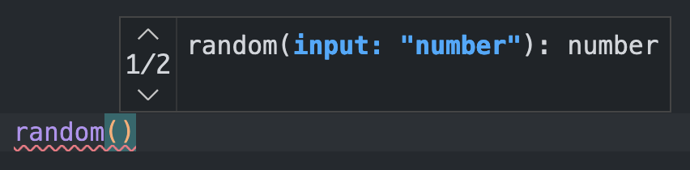

# 
  [](https://codecov.io/gh/adrgautier/fffunction)  [](https://www.npmjs.com/package/fffunction)

**fffunction** is a tool which simplifies **polymorphic** functions declaration and adds **type constraints** to the implemention function.

> This module is experimental: use it at your own risk. 

# Motivation

Out of the box, it is not possible in TypeScript to declare polymorphic functions **with proper type checking** of the implementation.

This project tries to adresses this problem, by providing **a simple API** to declare type checked polymorphic functions.

# Quick example

Here is an example of a function which return either a random `number` or a random `string` according to its input value:

```ts
const random = fffunction
    .f<"number", number>()
    .f<"string", string>()
    .f(function ({ input, output }) {
      if (input === "number") {
        return output(Math.random());
      }
      return output(uuidv4());
    });
```

If the value `"number"` is provided, a random number will be returned.

```ts
console.log(random("number")); // 0.024689827372012196
```

If the value `"string"` is provided, an uuid will be returned.
```ts
console.log(random("string")); // 425dd1a0-cfc0-4eac-a2d7-486860d9bdd4
```

The returned type **is guaranted** by the `output` function.

# How to use 

## Signatures declaration

### `.f<TInput, TOutput>()`

Declaring a function signature is done by calling the `.f()` method with no argument and using the generic as follow:

```ts
fffunction
   .f<"string", string>()
```

The **first argument** in the generic defines the accepted **input** type. The **second argument** defines the expected **return / output** type.

Signature declarations are queued like this:

```ts
fffunction
   .f<"string", string>()
   .f<"number", number>()
```

### Constraints

Input types can overlap each others, however the **most specific** input types must be **declared first**:

```ts
fffunction
   .f<{ id: number, name: string }, Profile>()
   .f<{ id: number }, Item>()
```

*fffunction* prevents declaring signatures in the **wrong order**:

```ts
fffunction
   .f<{ id: number }, Item>() 
   .f<{ id: number, name: string }, Profile>()
                                    ^^^^^^^ 
// Type 'Profile' does not satisfy the constraint 'never'. ts(2344)
```

*Literals* **cannot overlap** each others:

```ts
fffunction
   .f<`https://${string}`, URL>() 
   .f<string, string>() 
              ^^^^^^   
// Type 'string' does not satisfy the constraint 'never'. ts(2344)
```

This ensures that each input type can be **narrowed down** later in the function implementation. 

## Function implementation  

### `.f<TAdHoc>(implementation)`

The implementation of the function is based on the concept of [type narrowing](https://www.typescriptlang.org/docs/handbook/2/narrowing.html).

```ts
/*...*/
   .f(function implementation({ input, output }) { /*...*/ })
```

The `implementation` function (named here for the example) will receive a `FFFArgument` object. This argument carries two informations :
- the input value on the `input` property
- the `output()` method (more on that later)

### Narrowing type

In the main scope of the function, the type of the `input` property is **uncertain**. It can be either of the input types defined in the signatures. We want to create a narrowed scope for each possible type :

```ts
function implementation ({ input, output }) {
   // input is "number" | "string"
   if (input === "number") {
      // input is "number"
   } else {
      // input is "string"
   }
})
```

### `output()`

Behind the scene, TypeScript is also able to narrow down the type of the `output()` method. This method will make sure the returned value **matches the expected output type**.

```ts
function implementation ({ input, output }) {
   if (input === "number") {
      return output(1234);
   }
   return output('test');
})
```

> This method is **mandatory**. You can't return any value without using this method.  
> In fact, it must also be called for **void returns** :
> ```ts
> return output();
> ```


### Inference limitations

Out of the box, you will only be able to **narrow the input** type from *literals* (string, number or boolean). As soon as you work **with objects**, the inference **doesn't work anymore**.

```ts
fffunction
   .f<{ id: number, name: string }, 'profile'>()
   .f<{ id: number }, 'item'>()
   .f(({ input, output }) => {
      if('name' in input) {
         return output('profile');
                       ^^^^^^^^^
         // Type 'string' does not satisfy the constraint 'never'. ts(2344)
      }
      return output('item');
   });
```

If you need to work **with objects** in input, I recommand using **[ts-pattern](https://github.com/gvergnaud/ts-pattern)** to narrow down the input type:

```ts
fffunction
   .f<{ id: number, name: string }, 'profile'>()
   .f<{ id: number }, 'item'>()
   .f((a) => 
      match(a)
         .with({ input: { name: P.string } }, ({ output }) => output('profile'))
         .otherwise(({ output }) => output('item'))
   );
```


### Optional "ad hoc" mode

You can enable the **"ad hoc" mode** by passing true to the generic :

```ts
.f<true>(implementation);
```

This mode allow to declare the polymorphic function using [function overloading](https://www.typescriptlang.org/docs/handbook/2/functions.html#function-overloads) instead of conditional return type.

#### Benefit

This can make the resulting function easier to understand with each signature individially identifiable.


|Default|Ad hoc|
|-------|------|
|||


#### Drawback

With this approach you loose the ability to call the function with uncertain input data. E.g. the following is not possible :

```ts
random(mode as "string" | "number"); // No overload matches this call.
```

With the above example, `mode` must be either `"string"` or `"number"`. The uncertainty is not allowed.

# Troubleshoot

## Signature declaration

### `TS2344: Type 'A' does not satisfy the constraint 'never'`

```ts
.f<"string", string>()
             ^^^^^^
```

That means input of two signatures are conflicting. See the **input overlapping** section above.


## Function implementation

### `TS2344: Type 'A' does not satisfy the constraint 'never'`

```ts
return output(value);
              ^^^^^ 
```

The type `input` type has not been narrowed down enough or properly.


### `TS2322: Type 'A' is not assignable to type 'FFFOutput<A | B>'`

```ts
return value;
       ^^^^^ 
```

You are trying to return a value without the `output` function.

